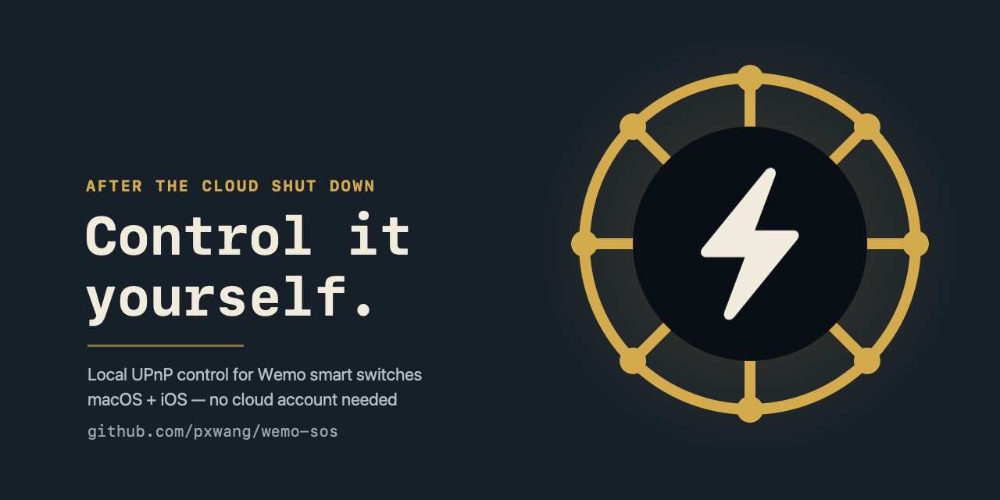

# wemo-sos



Belkin shut down the Wemo cloud service, stranding previously
cloud-controlled Wemo smart switches. Wemo devices never actually needed the
cloud for local control though — they speak plain UPnP on your home network.
This repo is a rescue kit: pick whichever app matches your device below —
they're independent, so you only need the one you actually want.

- **[🖥 macOS app](#-macos-app)** — a menu bar utility for your Mac
- **[📱 iOS app](#-ios-app)** — an iPhone app
- **[⏰ Scheduling](#-scheduling-cli--launchd)** — CLI + `launchd` jobs to replace the schedules the Wemo app used to set

Both apps talk to your switches the same way — **UPnP**: SSDP for
discovery, SOAP-over-HTTP (`GetBinaryState` / `SetBinaryState`) for control
— directly between your device and the switch, nothing else involved.

---

## 🖥 macOS app


A menu bar app (🔌 icon, no Dock icon) — click a switch to toggle it,
"Discover Devices" to re-scan. Discovers switches via SSDP multicast, which
works without restriction on macOS.

```bash
cd WemoControl
swift build -c release
```

Full build/package/install instructions: **[`WemoControl/README.md`](WemoControl/README.md)**.

## 📱 iOS app


A SwiftUI iPhone app with the same idea — device list, tap to toggle,
auto-refreshes every 30s. Requires full Xcode + a free Apple ID (apps
signed this way expire after 7 days and need reinstalling — an Apple
platform restriction, not fixable from the project).

Discovery works differently here than on the Mac: real iPhones block raw
SSDP multicast without a paid-account-only Apple entitlement, so this app
unicast-scans your subnet instead. Details, build steps, and command-line
install instructions: **[`WemoControlIOS/README.md`](WemoControlIOS/README.md)**.

## ⏰ Scheduling (CLI + launchd)

Since Wemo switches can no longer be scheduled through the (defunct) cloud
app:

- `scripts/wemo_ctl.py` — standalone CLI (Python stdlib only) to turn a
  named device on/off: `wemo_ctl.py on "Night Light"`
- `launchd/*.plist` — example job pairs that turn a switch on/off on a
  schedule, using that script

Setup: `launchd/*.plist` files use a placeholder script path
(`/path/to/wemo_sos/scripts/wemo_ctl.py`) — edit it to your actual clone
location, and adjust the device name/schedule times, before
`launchctl load`-ing them.

---

## License

MIT — see [LICENSE](LICENSE). Personal project, shared as-is in case it
helps someone else in the same "my smart switches went dark" situation.
