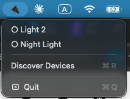
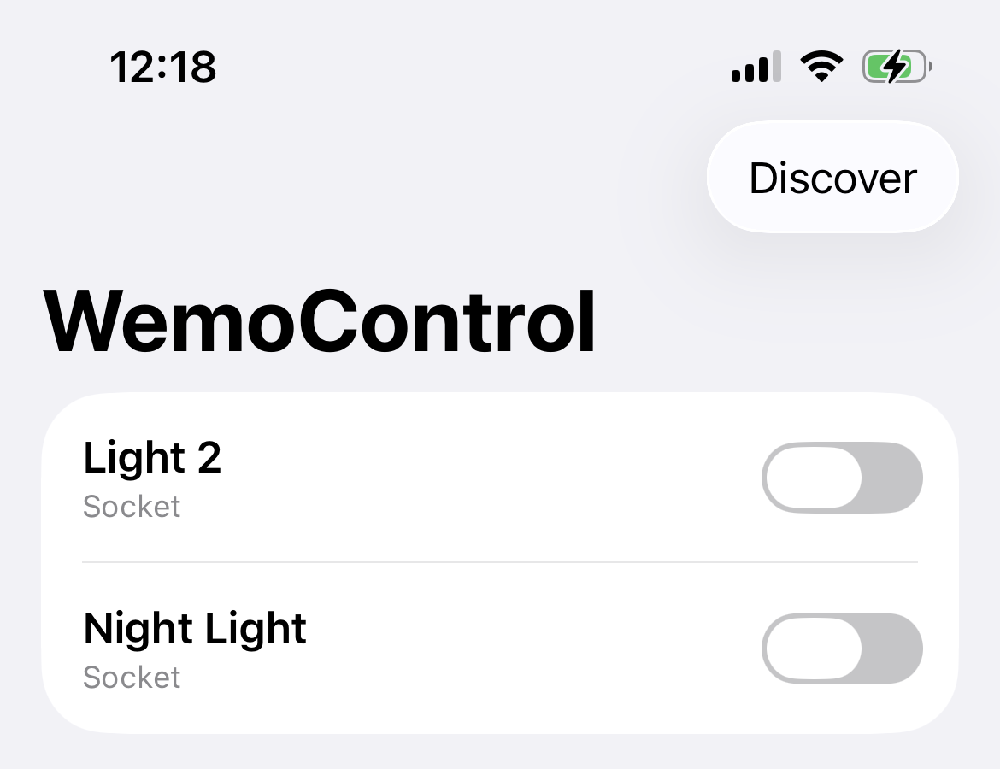

# wemo-sos

Belkin shut down the Wemo cloud service, stranding previously
cloud-controlled Wemo smart switches. Wemo devices never actually needed the
cloud for local control though — they speak plain UPnP on your home network.
This repo is a rescue kit: a Mac menu bar app, an iOS app, and some CLI/
scheduling tooling, all talking to Wemo switches directly over LAN with no
cloud account involved.

<table>
<tr>
<td> macOS menu bar app</td>
<td> iOS app</td>
</tr>
</table>

## What's here

| Path | What it is |
|---|---|
| `WemoControl/` | macOS menu bar app (Swift Package). Discovers switches via SSDP, toggles them from a 🔌 menu bar icon. |
| `WemoControlIOS/` | iOS app (SwiftUI). Same idea, for iPhone — see its README for a platform quirk that changes how discovery works there. |
| `scripts/wemo_ctl.py` | Standalone CLI (stdlib-only Python) to turn a named device on/off. Used for scheduling. |
| `launchd/` | Example `launchd` job pairs that turn a switch on/off on a schedule, replacing what the (defunct) Wemo app used to do. |

## How discovery/control works

Wemo switches use **UPnP**:

- **Discovery**: SSDP `M-SEARCH` multicast query (`239.255.255.250:1900`),
  collecting the `LOCATION` URLs devices reply with.
- **Control**: SOAP actions (`GetBinaryState` / `SetBinaryState`) posted over
  plain HTTP to each device's `basicevent` endpoint.

The iOS app can't use SSDP multicast on real hardware — see
`WemoControlIOS/README.md` for why, and the unicast-subnet-scan workaround it
uses instead.

## Setup notes

- The iOS project (`WemoControlIOS/project.yml`) has `DEVELOPMENT_TEAM:
  YOUR_TEAM_ID` — replace with your own Apple Developer Team ID before
  building (see the comment next to it for how to find it). The generated
  `.xcodeproj` is gitignored; regenerate it with
  [XcodeGen](https://github.com/yonaskolb/XcodeGen) (`brew install xcodegen`
  then `xcodegen generate`).
- `launchd/*.plist` files use a placeholder script path
  (`/path/to/wemo_sos/scripts/wemo_ctl.py`) — edit it to your actual clone
  location, and adjust the device name/schedule times, before
  `launchctl load`-ing them.

## License

MIT — see [LICENSE](LICENSE). Personal project, shared as-is in case it
helps someone else in the same "my smart switches went dark" situation.
